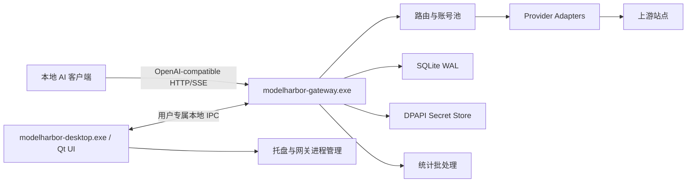
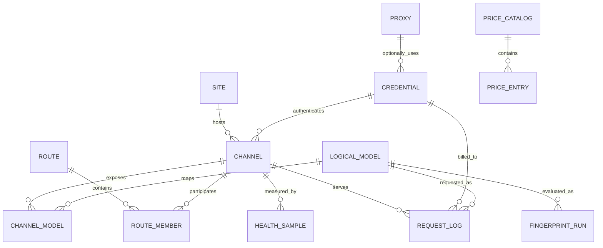
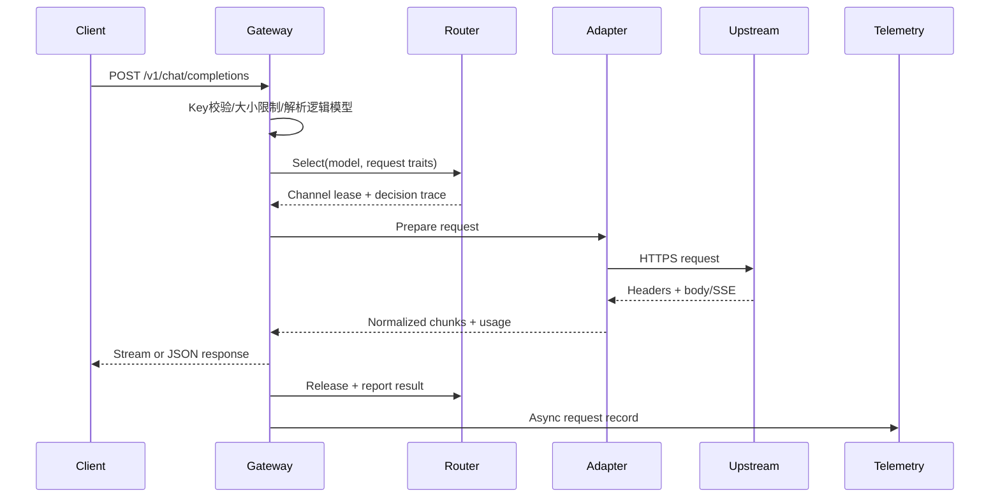

# ModelHarbor 技术架构

## 1. 架构决定

| 项目 | 已锁定方案 | 原因 |
| --- | --- | --- |
| 平台 | Windows 10/11 x64 | 与现有 Qt 环境和本地工具定位一致 |
| 语言 | C++20 | 类型安全、性能和 Qt 生态 |
| UI | Qt 6.11.1 Widgets | 纯 C++、成熟表格、较低资源占用 |
| 构建 | CMake Presets + Ninja | 本地与 CI 命令一致 |
| 发布编译器 | MSVC x64 | Windows 部署、诊断和 Qt 官方二进制兼容性 |
| 进程模型 | 桌面端与网关双进程 | UI 重启不影响代理，职责与故障隔离清楚 |
| 入站 HTTP | Boost.Asio + Boost.Beast | 流式控制、背压和连接生命周期可控 |
| 出站 HTTP | libcurl multi | TLS、代理、连接复用、计时指标和流式回调成熟 |
| 数据库 | SQLite + WAL | 单机部署简单，事务和查询能力足够 |
| 凭据保护 | Windows DPAPI CurrentUser | 密文绑定当前 Windows 用户 |
| JSON | yyjson | 快速解析、可变 DOM、精确处理整数类型 |
| 测试 | Qt Test + CTest | 单一测试入口，适配 Qt 和纯 C++ 模块 |

首版表现层固定为 Qt Widgets。领域层、调度器、协议适配器和统计层不得依赖 `QtWidgets`；未来变更表现层必须先更新架构文档或 ADR，核心边界保持不变。

## 2. 总体结构



### 2.1 `modelharbor-desktop.exe`

- Qt Widgets UI、托盘、设置和状态展示。
- 启动、连接和监视网关进程。
- 通过本地 IPC 读写配置、触发检测、订阅运行事件。
- 不直接打开数据库，不持有解密后的长期凭据，不转发模型流量。

### 2.2 `modelharbor-gateway.exe`

- 监听本地 OpenAI-compatible API。
- 唯一负责数据库迁移和持久化写入。
- 管理敏感字段的加解密生命周期。
- 执行模型发现、健康检测、路由、重试、协议适配、计量和统计。
- 可独立运行；桌面端重启后通过 IPC 重连。

### 2.3 本地 IPC

- Windows 使用 `QLocalServer`/`QLocalSocket` 对应的命名管道。
- 管道名包含当前用户 SID 的不可逆摘要，ACL 只允许当前用户访问。
- 发布协议采用长度前缀 JSON 消息，包含版本、request_id、method、payload 和 error。
- S1.2 技术验证使用换行分帧 JSON 和每个桌面进程独立的 IPC 名称；进入 S1.3 发布门禁前必须切换为 SID 派生名称、长度前缀分帧和完整断线重连测试。
- 大型日志列表使用分页；实时事件使用独立订阅通道并设置队列上限。
- IPC 数据结构版本独立于数据库版本，破坏性变更必须升主版本。

### 2.4 桌面端、网关与托盘生命周期

- 桌面端是网关子进程的默认所有者，启动时负责创建或重新连接网关，并通过状态订阅显示监听地址、版本和健康状态。
- 用户关闭主窗口时由桌面端执行一次明确的生命周期决策：选择“最小化到托盘并保持服务”则隐藏窗口、保留托盘图标，桌面端与网关继续运行；选择“退出软件”则发送 `shutdown` IPC 请求，等待网关停止接收新请求、刷新统计并关闭数据库后移除托盘图标并退出。
- `shutdown` 有固定截止时间。超时只允许桌面端终止自己创建的网关子进程，并把超时原因写入脱敏诊断日志；正常退出路径不能留下托盘或后台网关。
- 桌面端崩溃、系统重启或 UI 更新不等同于用户选择“退出软件”。网关可在短暂的父进程断联窗口内继续服务，桌面端下次启动通过 IPC 重新连接并显示上次状态；网关重启和数据库恢复由网关自身完成。
- 托盘菜单只提供显示窗口、立即巡检、复制本地地址和退出软件等动作。托盘退出与主窗口“退出软件”共用同一优雅关闭用例，不能绕过统计刷新和 lease 释放。

## 3. 仓库结构

计划中的目录结构：

```text
modelharbor/
├─ AGENTS.md
├─ CMakeLists.txt
├─ CMakePresets.json
├─ vcpkg.json
├─ cmake/
├─ apps/
│  ├─ desktop/
│  └─ gateway/
├─ src/
│  ├─ domain/          # 实体、值对象、错误和接口
│  ├─ application/     # 用例编排
│  ├─ gateway/         # HTTP、SSE、请求生命周期
│  ├─ routing/         # 候选过滤、轮询、熔断、并发槽
│  ├─ providers/       # OpenAI/Sub2 各平台适配器
│  ├─ diagnostics/     # 健康、能力指纹、倍率测试
│  ├─ persistence/     # SQLite、迁移、仓储
│  ├─ security/        # DPAPI、Key 摘要、脱敏
│  ├─ telemetry/       # 请求明细、聚合和日志
│  ├─ ipc/             # 管理协议
│  └─ ui/              # Widgets、Model/View、主题
├─ resources/
│  ├─ icons/
│  ├─ themes/
│  └─ migrations/
├─ tests/
│  ├─ unit/
│  ├─ component/
│  ├─ integration/
│  ├─ fixtures/
│  └─ performance/
├─ tools/
└─ docs/
```

依赖方向固定为：UI/HTTP/IPC -> application -> domain。persistence、providers、security 和 telemetry 实现 domain 中的接口。domain 不包含 Qt UI、SQL、HTTP 或平台 API 细节。

## 4. 核心领域模型

### 4.1 实体关系



### 4.2 关键实体

- `Site`：名称、Base URL、协议类型、TLS 策略、默认超时。
- `Credential`：平台、账号类型、密文引用、过期时间、代理、账号池状态、导入来源。
- `Channel`：站点与凭据的可调度组合，包含优先级、权重、并发和健康策略。
- `LogicalModel`：本地对外模型名、能力标签和默认价格基准。
- `ChannelModel`：逻辑模型到该渠道上游模型名的映射及验证状态。
- `Route`：某个逻辑模型或匹配规则的候选集合与调度模式。
- `AccountGroup` / `AccountTag`：账号池的非敏感组织关系，用于筛选、批量操作和默认路由归类。
- `ImportJob` / `ImportJobItem`：异步导入任务及逐条预检、冲突、提交和验证状态。
- `HealthState`：连续成功/失败、熔断状态、冷却截止时间和 EWMA 指标。
- `ChannelStateEvent`：自动禁用、手动停用、冷却、探测和自动启用的结构化状态记录。
- `RequestRecord`：一次请求的路由、延迟、usage、成本和错误结果。
- `FingerprintRun`：测试包版本、各测试结果、原始证据摘要和总判定。

站点、凭据和渠道分开建模是必要条件。同一个站点可以有多个 Key；同一个凭据可以在不同模型映射或路由参数下形成不同渠道；账号池状态属于凭据，模型健康属于渠道模型。

## 5. 数据库设计

### 5.1 初始表

```text
schema_migrations
app_settings
sites
secrets
credentials
proxies
channels
logical_models
channel_models
routes
route_members
routing_cursors
health_samples
health_states
fingerprint_runs
fingerprint_cases
price_catalogs
price_entries
local_api_keys
request_logs
usage_daily
account_groups
account_tags
credential_tags
channel_state_events
import_jobs
import_job_items
```

### 5.2 SQLite 规则

- 启用 `foreign_keys=ON`、WAL、`busy_timeout`，发布默认 `synchronous=NORMAL`。
- 网关是唯一写入者；高频请求明细进入有界队列，由单独线程批量事务落盘。
- 队列满时优先丢弃可重建的调试事件，不丢失请求总数、失败数和金额聚合。
- 所有表有稳定整数主键；跨进程消息使用字符串形式，避免 JSON 数字精度问题。
- 金额保存为整数微美元或定点字符串；倍率保存计算输入与结果，便于重算。
- 时间持久化为 UTC 毫秒，UI 按本地时区展示。
- 数据库迁移只前进，每个版本一个文件和一组迁移测试。
- `import_jobs` 与 `import_job_items` 保存导入来源、格式版本、预检状态、冲突策略、取消/继续标记和逐条错误分类；原始凭据不进入这些表。
- 账号分组和标签是非敏感关系数据；凭据、代理和账号备注的敏感部分仍按统一脱敏与 DPAPI 规则处理。
- `channel_state_events` 保存状态转换原因、错误分类、作用域、自动/手动来源、冷却截止和探测结果，便于路由解释与误判复盘。

### 5.3 备份

- 使用 SQLite Online Backup API 生成一致性快照。
- 普通备份保留 DPAPI 密文，只能由同一 Windows 用户解密。
- 可移植敏感备份使用用户输入口令和独立加密容器，作为后续能力。
- 导出 Sub2API 结构时明确标记包含凭据，并先生成到临时文件后原子替换目标文件。

## 6. 密钥与敏感数据

### 6.1 存储

- 每条敏感记录使用 DPAPI CurrentUser 模式加密，密文包含格式版本。
- `secrets` 表只保存密文、类型、创建时间和轮换元数据。
- 明文只在发起上游请求或刷新 Token 的最短作用域内存在，使用后清理可控缓冲区。
- 去重指纹使用应用级随机密钥做 HMAC；该密钥本身由 DPAPI 保护。
- 本地 API Key 自动生成至少 256 bit 随机值，数据库保存带盐摘要，不保存原文。

### 6.2 日志脱敏

- 日志 API 只接受结构化字段，Authorization、Cookie、token、secret、password、key 等字段在写入器统一过滤。
- URL 查询参数中的敏感名也要过滤。
- 上游错误正文截断并再次脱敏后才可入库。
- 生产构建关闭正文日志；请求实验室的原始响应仅在当前 UI 会话内显示，除非用户显式导出。

### 6.3 网络默认值

- 客户 API 默认只绑定 `127.0.0.1` 和 `::1`。
- 管理接口只走当前用户命名管道。
- 上游默认校验证书与主机名；每站点的自定义 CA 是明确配置。
- 请求体、响应头和解压后正文均有大小上限。
- 跟随重定向默认关闭，避免 Authorization 被带到不同主机。

## 7. Provider Adapter

适配器接口负责差异，不把平台判断散落到路由和 UI：

```cpp
class IProviderAdapter {
public:
    virtual AdapterId id() const = 0;
    virtual ValidationResult validate(const Site&, const CredentialView&) = 0;
    virtual Task<ModelList> discoverModels(const RequestContext&) = 0;
    virtual PreparedRequest prepareChat(const ChatRequest&, const Channel&) = 0;
    virtual StreamEvent parseStreamChunk(ByteSpan) = 0;
    virtual CompletionResult parseCompletion(ByteSpan) = 0;
    virtual Usage parseUsage(const ResponseView&) = 0;
    virtual ProviderError classifyError(const ResponseView&) = 0;
    virtual Task<RefreshResult> refreshCredential(const CredentialView&) = 0;
    virtual Task<BillingSnapshot> queryBilling(const CredentialView&) = 0;
    virtual ~IProviderAdapter() = default;
};
```

接口只是方向示例，开发时先由测试用例确定最终签名。适配器需要声明能力矩阵，例如 stream、tools、JSON schema、cache usage、billing query 和 token refresh。

首个适配器是 OpenAI-compatible API Key。Sub2API 导入的各平台账号按独立适配器逐个加入。未实现适配器的账号保留在数据库中，但状态为 `unsupported_runtime`，不会进入调度候选。

### 7.1 账号导入与调度状态边界

导入流水线的状态由网关维护，桌面端只展示和发起用例：

```text
parsed -> normalized -> preflighted -> previewed -> stored
preflighted -> rejected
stored -> validating -> verified -> schedulable
validating -> blocked
stored -> expired
stored -> unsupported_runtime
```

- `parsed` 到 `previewed` 只处理文件内容、格式、去重键和字段差异，不写入正式账号池。
- `stored` 表示账号和代理关系已在一个事务中落库，敏感字段已转换为 secret 引用；不代表凭据可用。
- `verified` 需要适配器完成最低成本凭据检查；`schedulable` 还要求至少一个逻辑模型映射有效、未被禁用、未过期且具备路由资格。
- `blocked`、`expired` 和 `unsupported_runtime` 记录可解释原因；状态改变通过不可变配置快照原子发布到路由器。
- 批量任务支持取消和继续：取消只阻止未提交条目，已提交事务不回滚到半条状态；继续任务使用导入项稳定 ID 保证幂等。

桌面端的添加账号表单按 OAuth、Token/JSON、API Key、本地文件导入四种来源组织，但所有来源最终进入同一 application 用例和上述状态机。UI 不直接解析大文件、不访问 SQLite，也不保存长期明文凭据。

## 8. 请求生命周期



每个请求持有：

- 全局截止时间和取消源。
- 路由快照版本、已尝试渠道集合和选路轨迹。
- 当前渠道的并发 lease；所有退出路径由 RAII 释放。
- 增量 SSE 解析器和有界输出缓冲区。
- 使用 `steady_clock` 的起点、首个有效内容点和结束点。
- 旁路统计对象；统计失败时，已经返回给客户端的成功响应维持原状。

## 9. 并发与线程模型

### 9.1 桌面端

- GUI 主线程只负责绘制和短任务。
- IPC 客户端异步收发；大列表解析和导入预览放入工作线程。
- 所有表格使用 `QAbstractTableModel`，后台结果通过批量变更信号更新。

### 9.2 网关

- Beast 入站由固定大小 Asio 线程池处理。
- libcurl multi 使用独立事件循环，复用连接和 TLS session。
- 调度变更、轮询游标和熔断状态通过 Asio strand 串行化，读取使用不可变快照。
- SQLite 写入由单线程批处理器处理；配置变更事务完成后发布新路由快照。
- 健康检查和指纹任务使用有界队列，与真实流量并发预算分离。

线程数由硬件并发与配置共同决定，不按请求创建线程。所有跨线程队列必须有容量、丢弃策略和指标。

## 10. 路由算法

### 10.1 候选过滤

候选过滤返回结构化原因：disabled、unsupported_model、credential_expired、circuit_open、cooldown、quota_exhausted、concurrency_full、adapter_unavailable。UI 的路由解释直接读取这些原因。

### 10.2 严格轮询

- 键为 `route_id + logical_model_id`。
- 调度状态在 strand 内更新，确保并发请求看到单一序列。
- 从游标的下一个位置开始扫描，找到首个能取得并发 lease 的候选。
- 成功取得 lease 后提交新游标；全组均满时保持游标并返回容量错误或进入下一优先级。
- 数据库只周期性保存游标快照，进程重启后允许从快照继续；公平性测试不依赖具体初始位置。

### 10.3 平滑加权轮询

采用 Smooth Weighted Round Robin：每轮给候选增加 effective weight，选择 current weight 最大者，再减去总权重。健康降级可临时降低 effective weight，恢复时逐步回升。

### 10.4 熔断

熔断器按渠道模型维护，站点级传输错误可同时更新站点汇总状态。HalfOpen 探测受并发 1 限制，真实请求与后台探测互斥使用唯一探测槽。

### 10.5 自动禁用与自动启用

- 错误分类由 Provider adapter 产生结构化结果，路由器只消费 `auth_failure`、`model_mapping_failure`、`quota_exhausted`、`rate_limited`、`transport_failure` 等类别，不按供应商字符串散落判断。
- `auth_failure` 默认立即把凭据标记为 `auto_disabled_auth`，其关联渠道全部从候选快照移除；`model_mapping_failure` 只移除对应 `ChannelModel`；传输失败和 429 先进入冷却，再按策略阈值转为 `auto_disabled_health`。
- 策略包含 `auto_disable_enabled`、错误类别阈值、时间窗、冷却时长、自动启用开关和探测间隔。首版兼容模式允许一次低成本探测成功即从 HalfOpen 恢复，后续再增加连续成功、指数退避和抖动抑制。
- `manual_disabled` 不参与自动启用；鉴权错误的自动启用必须有新的凭据版本或重新认证结果。所有状态变化都在配置事务提交后构建不可变路由快照并原子发布。
- 状态事件必须带 channel/credential 内部 ID、错误分类、触发请求 ID、时间、禁用截止、探测结果和状态转换原因，不写入完整凭据或请求正文。

## 11. 流式代理与背压

- 入站和出站都按块处理，不拼接完整 SSE 文本。
- 解析器保留跨块残行，按 UTF-8 字节处理，只有完整 `data:` 事件才交给 JSON 解析。
- 转发队列设置高低水位；客户端读取慢时暂停 libcurl 接收，恢复后继续。
- 客户端断开会取消上游 easy handle、释放 lease 并记录 `client_cancelled`。
- 首字发送后上游中断，关闭当前响应并记录不完整流；此时不切到第二渠道。
- 对非流式响应设最大内存阈值，超过阈值使用临时文件或返回大小错误，具体行为在实现前由测试固定。

## 12. 计量与价格

`Usage` 使用显式可选字段：input、output、cached_read、cached_write、reasoning、audio_input、audio_output。缺失与零值必须区分。

价格表含 provider、model pattern、currency、effective_from、source、input/output/cache 等价格桶和版本。请求开始时固定价格表版本，结束时用同一版本计算。汇率也按版本保存。

延迟聚合使用可合并直方图；成功率和成本按日预聚合。TTFT 只对流式或能识别首个有效内容的响应统计，普通完整 JSON 响应另记 TTFB/total，避免混淆。

## 13. UI 架构

- `QMainWindow` + 紧凑侧栏 + `QStackedWidget`。
- 每页使用 Presenter/ViewModel 调用 application service，不直接拼 IPC JSON。
- 大表格统一 `QAbstractTableModel`、`QSortFilterProxyModel`、分页和列状态保存。
- 主题使用设计 Token 和 QSS；浅色、深色共用语义色，不在控件中硬编码颜色。
- 图标从 Lucide ISC 许可资源生成 Qt Resource，统一 16/20 px 和工具提示。
- 图表优先使用轻量 QPainter 组件，避免为了少量折线引入大型 WebView。
- 无边框窗口只在确认 DPI、拖拽、系统菜单和可访问性均稳定后采用；首版优先标准窗口框架。

## 14. 测试架构

### 14.1 单元测试

- URL 规范化、模型映射、价格计算、错误分类。
- 严格轮询、SWRR、优先级回退、并发 lease 和熔断状态机。
- SSE 分块、usage 解析、脱敏和导入去重。
- 注入虚拟时钟与确定性随机源，避免依赖 sleep 的脆弱测试。

### 14.2 组件测试

- 本地 fake upstream 模拟流式、慢响应、429、401、5xx、断流和畸形 JSON。
- SQLite 临时库验证事务、迁移、崩溃恢复和批量写入。
- DPAPI 使用专用测试秘密，断言数据库与日志没有明文。

### 14.3 集成测试

- 客户端 -> 本地网关 -> fake upstream 的完整链路。
- 300/1000 次公平性测试和 32 并发竞争测试。
- Sub2API 各版本夹具的预览、冲突策略、代理映射和回滚。
- 账号添加四入口、导入预检分类、选中提交、后台取消/继续和调度状态转换。
- 桌面端启动网关、状态订阅、网关重启与托盘生命周期。

### 14.4 性能测试

- 本机非流式小响应吞吐与附加延迟。
- 100 条并发 SSE 长连接的内存、CPU 和首字附加延迟。
- 百万条请求日志下的分页、聚合和 UI 滚动。

性能结果写入可比较的 JSON 报告；固定硬件夹具下出现明显回退时阻断发布。

## 15. 依赖与许可证策略

- 依赖通过 `vcpkg.json` 和 baseline 固定版本，禁止隐式下载最新版本。
- 发布包动态链接 Qt，并附带 Qt/LGPL、Lucide/ISC、Boost、curl、OpenSSL、yyjson 等许可文本。
- 本项目默认采用 [CC BY-NC-SA 4.0](https://creativecommons.org/licenses/by-nc-sa/4.0/deed.zh-hans)；商业场景须另行取得作者书面授权，联系方式为 `1305508372@qq.com`。第三方依赖和参考项目继续遵循各自许可证。
- New API 为 AGPL 项目，Sub2API 为 LGPL 项目；本项目只参考公开行为、数据格式和渠道自动禁用工作流，采用独立设计与实现。
- Cockpit Tools 调研基线为提交 `06bf8f781e117ced84e52d93521646a3db862715`，其 README 声明采用 CC BY-NC-SA 4.0。本项目只记录账号池和添加账号的交互行为，不复制源码、样式资源或文本。
- 引入新依赖前记录用途、许可证、体积、维护状态和可替代方案。

## 16. 仍需验证的技术风险

1. Beast 与 libcurl multi 的背压桥接需要先做流式技术验证。
2. 不同 Sub2API 账号类型的凭据刷新和上游协议变化频繁，需要按适配器固定兼容夹具。
3. 上游 usage 和账单字段差异很大，倍率证据等级必须贯穿数据库与 UI。
4. Windows 睡眠、网络切换和系统代理变化会影响长连接，需要恢复测试。
5. DPAPI 密文跨 Windows 用户不可迁移，备份体验需要清楚区分本机快照和可移植备份。
